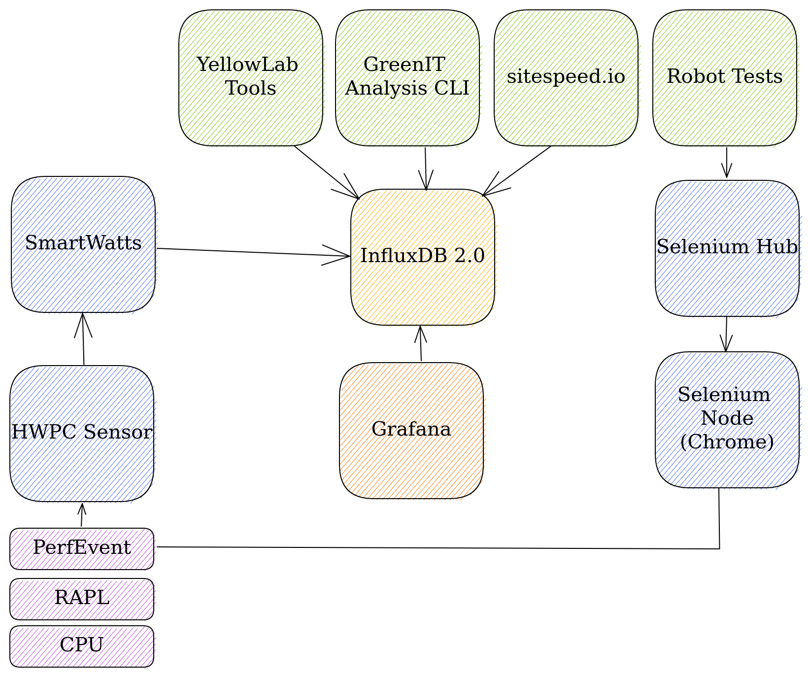

# Eco Platform Analyzer 

## Outillage


### SiteSpeed.io

> Monitoring et analyse des performances dans un navigateur 

**Description**

Pour réaliser ce type d'analyse nous avons retenu http://sitespeed.io/ qui est composé d'un ensemble d'outils de mesures. 
Cet outil exploite les datas exposées par les debuggers des navigateurs.
Nous y retrouvons l'ensemble des informations nécessaires à la réalisation de métriques : performance, timing, réseaux, ressources, etc.
Les navigateurs supportés sont : Chrome, Firefox, Edge et Safari.

**Intégration**

Cet outil peut être utilisé en standalone en local via docker ou dans un pipeline de CI/CD en mode docker. 

> Exemple de son usage via docker en local

```console
docker run --rm -v "$(pwd):/sitespeed.io" sitespeedio/sitespeed.io:16.10.3 https://www.sitespeed.io/
```

> Exemple de son usage dans une CI, il faudra passer la configuration du endpoint de sortie, ici graphite.

```console
docker run --name sitespeed --network=eco-platform-analyzer_epa-network --shm-size=1g --rm -v "$(pwd):/sitespeed.io" \ 
    sitespeedio/sitespeed.io:16.10.3 https://www.arkea.com/ --cpu --sustainable.enable --axe.enable -b chrome \
    --graphite.host graphite --graphite.port 2003 --graphite.auth user:password --graphite.username guest --graphite.password guest
```

L'ensemble des configurations possibles sont exposées ici : https://www.sitespeed.io/documentation/sitespeed.io/configuration/

Sitespeed génère par défaut les résultats d'analyses au format HTMl à la racine de l'exécution du conteneur, mais il est possible de connecter plusieurs types de endpoints en sorties : 
- S3
- Influx
- Graphite (à utiliser pour les dashboard proposés par sitespeed)
- Slack

**Dashboard**

[Documentation sur les dashboard proposés par sitespeed](https://www.sitespeed.io/documentation/sitespeed.io/performance-dashboard/#page-summary)

[Image docker des dashboards Grafana](https://github.com/sitespeedio/grafana-bootstrap-docker)


### Scoring EcoIndex Green IT http://www.ecoindex.fr/ 

> Scoring basé sur l'évaluation des règles d'éco-conceptions

Utilisation du fork du plugin GreenIT https://github.com/cnumr/GreenIT-Analysis-cli.
Cet outil est à la base un plugin pour Chrome et Firefox permettant de réaliser un scoring des bonnes pratiques d'éco-conceptions.

Les bonnes pratiques sont issues du [référentiel édité par GreenIT.fr](https://collectif.greenit.fr/ecoconception-web/)

Nous avons pour l'occasion réalisée une contribution sur ce projet, qui consiste en l'ajout de l'écriture des résultats en base influx et d'un dahsboard grafana.

**Intégration**

Usage via docker :

```console
cd GreenIT-Analysis-cli && docker build -t ecoindex -f . && \
    docker run -it --init --rm --cap-add=SYS_ADMIN --network=eco-platform-analyzer_epa-network --name ecoindex ecoindex \
    --ci --influxdb --influxdb_hostname http://influxdb:8086 --influxdb_login admin --influxdb_password admin --influxdb_database db0
```

**Dashboard**


### Mesure de la consommation énergétique 

Utilisation de la suite d'outils exposé par le framework *PowerAPI* https://github.com/powerapi-ng
/!\ Ces outils sont utilisables uniquement sur une machine physique disposant des accès root /!\ 

Pour le besoin nous avons retenu les outils HWPC Sensor et Formula, ces derniers sont disponibles de manière conteneurisés.

#### HPWC 

> La mesure de consommation énergétique est possible par le biais de RAPL (RUNNING AVERAGE POWER LIMIT).

**Description**

RAPL expose des données des données de consommation sous forme de clé valeur : `Timestamp (ns) / joules`.
> Article expliquant succinctement le fonctionnement de RAPL : https://01.org/blogs/2014/running-average-power-limit-%E2%80%93-rapl 

>HPWC scrap la données via le kernel linux, lui-même ré-exposant ces données issues du CPU/DRAM/GPU. 
Ces données sont ensuite poussées au choix dans une base mongo ou dans un fichier texte.

https://powerapi-ng.github.io/hwpc.html

**Intégration**

```console
docker run --net=host --privileged --name hwpc-sensor -d 
    -v /sys:/sys 
    -v /var/lib/docker/containers:/var/lib/docker/containers:ro 
    -v /tmp/powerapi-sensor-reporting-firefox:/reporting powerapi/hwpc-sensor:latest 
    -n "hwpc-sensor" 
    -r "mongodb" -U "mongodb://172.17.0.2:27017" -D "powerapi" -C "data" 
    -s "rapl" -o -e "RAPL_ENERGY_PKG" 
    -s "msr" -e "TSC" -e "APERF" -e "MPERF" 
    -c "core" -e "CPU_CLK_THREAD_UNHALTED:REF_P" -e "CPU_CLK_THREAD_UNHALTED:THREAD_P" 
    -e "LLC_MISSES" -e "INSTRUCTIONS_RETIRED"
```

#### Formula 

> Formula réalise la conversion des données issues de HWPC en données exploitables.

**Description & intégration**

Il est nécessaire de fournir des informations à propos du CPU (lequel a été monitoré par HWPC) afin de réaliser la conversion.
Documentation : https://powerapi-ng.github.io/howto_monitor_process/deploy_formula.html#cpu-ratio

Ces informations sont les suivantes : 
- ratio de fréquence nominale
- ratio de fréquence minimale
- ratio de fréquence maximale

Ce qui pour un CPU (utilisé dans le développement du POC) de 1800mhz avec un min de 400mhz et un max de 4000mhz donne
- BASE_CPU_RATIO=18 
- MIN_CPU_RATIO=4 
- MAX_CPU_RATIO=40

Formula supporte l'écriture des données dans une base InfluxDB qui permettra de réaliser des graphs dans un outil comme Grafana.

https://powerapi-ng.github.io/howto_monitor_global/deploy_formula.html

```console
sudo docker run -td --net=host --name powerapi-formula powerapi/smartwatts-formula \
    -s \
    --input mongodb --model HWPCReport \
                   -u mongodb://172.17.0.2:27017 -d "powerapi" -c "data" \
    --output mongodb --name power --model PowerReport \
                    -u mongodb://172.17.0.2:27017 -d "powerapi" -c "data_computed" \
    --output mongodb --name formula --model FormulaReport \
                    -u mongodb://172.17.0.2:27017 -d "powerapi" -c frep \
    --formula smartwatts --cpu-ratio-base 18 \
                        --cpu-ratio-min 4 \
                        --cpu-ratio-max 40 \
                        --cpu-error-threshold 2.0 \
                        --dram-error-threshold 2.0 \
                        --disable-dram-formula
```
 
#### Dashboards

> Exemple d'un premier dashboard


À noter qu'il faudra aller plus loin dans la façon d'exploiter ces données :
- Dans un premier temps il peut être pertinent de corréler les mesures réalisées dans le temps et l'exécution des tests RobotFramwork
- Dans un second temps il faudra réaliser un calcul de type intégration (dans Grafana) en fonction de la durée des tests, dans l'idée d'avoir une valeur unique à la place d'une courbe  


### Selenium & Robot Framework

Pour la mesure de consommation énergétique d'un browser, nous avons retenu l'utilisation du framework Selenium.
Selenium expose un mécanisme de hub et de node afin de paralléliser les executions de tests et ceux sur différents navigateurs.
Les tests sont pilotés par Robot Framework, celui-ci va permettre de programmer la simulation de parcours utilisateur, 
les mesures de consommation énergétique seront réalisées en arrière-plan par écoute du PID des nodes par HWPC.

Il est toute fois envisageable de monitorer avec HWPC le PID d'un browser installé directement sur la machine.
Il faudra alors installer et configurer GeckoDriver afin de piloter le browser au travers de selenium hub.
Nous n'avons pas été en mesure de quantifier précisément le "bruit" généré dans un node selenium conteneurisé,
mais celui-ci apparait comme étant négligeable.


## Architecture



**EcoIndex**

- Un conteneur docker dédié GreenIT CLI Analysis
- Dépendance avec un conteneur InfluxDB
- Dépendance avec un conteneur Grafana et un dashboard

**Sitespeed.io**

- Un conteneur docker dédié SiteSpeed à exécuter
- Dépendance avec un conteneur Graphite 
- Dépendance avec un conteneur Grafana et un ensemble de dashboard

**PowerAPI**

L'analyse de la consommation énergétique est la partie nécessitant le plus d'outillage et de configuration.

- Une machine physique dédiée
- Un conteneur HWPC
- Un conteneur Forumla 
- Dépendance avec un conteneur MongoDB
- Dépendance avec un conteneur Graphite 
- Dépendance avec un conteneur Grafana et un dashboard
- Installation et configuration d'un Gitlab Runner Shell
- Installation et configuration des Cgroups Bin

**NB**

À noter que l'utilisation de ces différents outils est totalement modulaire en fonction des besoins.
Pour la réalisation du POC, l'ensemble des outils sont centralisés sur une seule machine.


### Installation de la stack complète via Docker Compose 

Pour un usage des outils en local il est possible de démarrer la stack au complet via le fichier `docker-compose.yml`. 

> Résultat du démarrage du `docker-compose.yml`

```console
conteneur ID   IMAGE                                                   COMMAND                  CREATED             STATUS                         PORTS                                                                                                                     NAMES
1f745f2edae2   ecoindex                                                "/app/greenit analys…"   About an hour ago   Exited (0) About an hour ago                                                                                                                             ecoindex
832e96f2932f   eco-platform-analyzer_robot-chrome-test                 "robot -v BROWSER:gc…"   2 days ago          Exited (1) 47 hours ago                                                                                                                                  robot-chrome-test
db935f0e845d   sitespeedio/grafana-bootstrap:16.0.0                    "/bin/sh -c /entrypo…"   2 days ago          Exited (0) 2 days ago                                                                                                                                    grafana_setup
adcd3fb75eab   powerapi/hwpc-sensor:latest                             "/usr/bin/hwpc-senso…"   2 days ago          Exited (1) 2 days ago                                                                                                                                    hwpc-sensor
8c1e5e7ad532   powerapi/smartwatts-formula:latest                      "python3 -m smartwat…"   2 days ago          Exited (1) 2 days ago                                                                                                                                    formula
e48287d27b04   selenium/node-chrome:4.0.0-beta-1-prerelease-20210207   "/opt/bin/entry_poin…"   2 days ago          Up 2 days                      0.0.0.0:6900->5900/tcp                                                                                                    selenium-node-chrome
57ef9b1a3f6c   grafana/grafana:7.4.2                                   "/run.sh"                2 days ago          Up 2 days                      0.0.0.0:3000->3000/tcp                                                                                                    grafana
3256fcf529a7   sitespeedio/graphite:1.1.7-9                            "/entrypoint"            2 days ago          Up 2 days                      2004/tcp, 2013-2014/tcp, 2023-2024/tcp, 8080/tcp, 0.0.0.0:2003->2003/tcp, 8125-8126/tcp, 8125/udp, 0.0.0.0:8092->80/tcp   graphite
69b425027705   influxdb:1.8.4                                          "/entrypoint.sh infl…"   2 days ago          Up 2 days                      0.0.0.0:8086->8086/tcp                                                                                                    influxdb
7964c928d49f   mongo:4.4-bionic                                        "docker-entrypoint.s…"   2 days ago          Up 2 days                      0.0.0.0:27017-27018->27017-27018/tcp                                                                                      mongo
302f1ac13dba   selenium/hub:4.0.0-beta-1-prerelease-20210207           "/opt/bin/entry_poin…"   2 days ago          Up 2 days                      0.0.0.0:4442-4444->4442-4444/tcp                                                                                          selenium-hub
```


### Usage en CLI via un pipeline Gitlab

> Exemple d'un pipeline Gitlab exécuté sur le GitlabRunner Shell via un fichier `.gitlab-ci.yml`

```yml
stages:
  - run_robot_test
  - run_sitespeed
  - run_ecoindex

services:
  - docker:dind

run_robot_test:
  stage: run_robot_test
  script: docker restart robot-chrome-test

run_sitespeed:
  stage: run_sitespeed
  script: docker run --name sitespeed --network=eco-platform-analyzer_epa-network --shm-size=1g --rm -v "$(pwd):/sitespeed.io" sitespeedio/sitespeed.io:16.8.1 https://www.arkea.com/ --cpu --sustainable.enable --axe.enable -b chrome --graphite.host graphite --graphite.port 2003 --graphite.auth user:password --graphite.username guest --graphite.password guest

run_ecoindex:
  stage: run_ecoindex
  script: docker restart eco-index
```

> Déclaration du runner dans Gitlab via un fichier `config.toml`

```toml
oncurrent = 1
check_interval = 0

[session_server]
    session_timeout = 1000

[[runners]]
    name = "runner-name"
    url = "https://gitlab.com/"
    token = "my_token"
    executor = "shell"
    [[runner.cache]]
        [runners.cache.s3]
        [runners.cache.gcs]
```

Chaque outil ayant sa propre implémentation, il faudra tendre à une variabilisation des url's utilisées dans les différents outils pour la réalisation des analyses.
  


### Installation et configuration de l'environnement pour l'analyse de la consommation énergétique 

1. docker et de docker-compose

https://docs.docker.com/engine/install/ubuntu/
https://docs.docker.com/compose/install/

2. node 14

```console
sudo apt-get update
sudo apt-get install nodejs npm
```

3. gitlab runner

https://docs.gitlab.com/runner/install/linux-manually.html

Vous devez ajouter le runner à la configuration de votre repository gitlab https://gitlab.com/your_project/-/settings/ci_cd,
en spécifiant le registration_token et l'url du gitlab à votre runner local.

> Donner les droits du process docker au daemon gitlab runner

```console
sudo usermod -aG docker gitlab-runner
```

4. Installation du package Cgroup

```console
sudo apt-get install cgroup-bin
```

4. 1. Pour un usage de powerapi avec un navigateur en local

Créer / éditer le fichier `/etc/cgconfig.conf` et y ajouter un event custom :

```
group firefoxEvent{
        perf_event{}
}
```

Créer / éditer le fichier `/etc/cgrules.conf` et réaliser un lien entre l'événement cgroup et le path du process à écouter :

```
user:/usr/lib/firefox/firefox	perf_event	firefoxEvent
```

Charger la configuration
```console
sudo cgconfigparser -l /etc/cgconfig.conf
```

Charger les règles

```console
sudo cgrulesengd -vvv --logfile=/var/log/cgrulesend.log
```


## Case d'usage à imaginer ou améliorations

* Aggregation des runtime de browser

    Les 3 outils : eco index, site speed et robot framework utilise chacun leurs propres runtime de browser.
    - GreenIT CLI Analysis utilise un Chronium par défaut et n'est pas configurable
    - Sitespeed.io utilise sa propre runtinme mais peu apparemment être configuré pour utiliser un selenium serveur
    - RobotFramework utilise selenium

    Le plus intéressant serait de converger sur un usage unique de selenium et donc de réaliser une contribution sur
    le plugin GreenIT CLI Analysis afin de le rendre compatible avec Selenium.   
    
* Analyse statique de code avec un plugin Sonar dédié 


À l'image du plugin GreenIT CLI Analysis, il est possible de réaliser le même type d'analyse via un plugin sonar custom.
Un début d'implémentation est disponible sur ce repository : https://github.com/cnumr/SonarQube

* Banc de tests

    L'objectif serait de constituer un parc de machines aux performances diverses.
    Lesquelles aurait à leurs dispositions une installation de PowerAPI avec un ou plusieurs node selenium.
    Ces derniers serait pilotés par des tests RobotFramework.
    Il pourrait également être intéressant d'exécuter Sitespeed à distance afin de monitorer les performances de navigation.
    Cela permettrait d'avoir une historisation de la consommation énergétique d'un front donné sur une machine donnée.
    
* Mesure de la consommation énergétique des VM's côté Data Center main frame  

   À noter qu'il existe d'autres outils exploitant la partie RAPL : 
   - Intel Power Gadget
   - https://github.com/mlco2/codecarbon
   - https://github.com/hubblo-org/scaphandre
   - https://github.com/chakib-belgaid/async-profiler
   
* Concevoir un index d'éco-conception à partir des métriques générées par ces différents outils

* Concevoir des dashboards personnalisé pour chaque type de profil 
   
   
## Références 

### Mesure de consommation énergétique 

#### RAPL (Running Average Power Limit)

  * https://www.kernel.org/doc/html/latest/power/powercap/powercap.html
  * http://web.eece.maine.edu/~vweaver/projects/rapl/index.html
  * https://01.org/blogs/2014/running-average-power-limit-%E2%80%93-rapl
  * https://blog.chih.me/read-cpu-power-with-RAPL.html
  * https://github.com/mozilla/gecko-dev/blob/master/tools/power/rapl.cpp
  * https://software.intel.com/content/www/us/en/develop/articles/intel-power-gadget.html

#### Android 

  * https://developer.android.com/studio/profile/energy-profiler
  * https://fpalomba.github.io/pdf/Conferencs/C15.pdf

#### iOS 

  * https://developer.apple.com/library/archive/documentation/Performance/Conceptual/EnergyGuide-iOS/MonitorEnergyWithInstruments.html

#### cgroups 

  * https://zarak.fr/linux/exploration-des-cgroups/
  * https://wiki.archlinux.org/index.php/cgroups
  * http://libcg.sourceforge.net/html/index.html
  * https://linux.die.net/man/1/cgcreate
  * https://linux.die.net/man/1/cgclassify

#### Power API 

  * https://gitter.im/Spirals-Team/powerapi
  * https://hal.inria.fr/hal-02470128/document
  * https://hal.inria.fr/hal-02470128
  * https://github.com/powerapi-ng
  * https://www.youtube.com/watch?v=NAGeLmgYNTw
  * https://github.com/chakib-belgaid/powerapi-g5k

#### Power consumption 
  * https://hal.inria.fr/hal-02470128/document
  * https://hal.inria.fr/hal-01403486/document
  * https://blog.theodo.com/2020/05/greenit-measure-server-energy-consumption-powerapi/
  * https://www.apiscene.io/sustainability/measuring-the-energy-consumption-of-an-api/

#### Power consumption tools
  * https://github.com/powerapi-ng
  * https://github.com/hubblo-org/scaphandre
  * https://github.com/chakib-belgaid/async-profiler
  * https://github.com/mlco2/codecarbon

### Framework Front Web 

#### SvelteJS 
  * https://blog.ippon.fr/2020/12/16/svelte-compiler-pour-mieux-regner/
  * https://www.svelteradio.com/episodes/whats-new-in-sveltia
  * https://dev.to/lukocastillo/svelte-3-how-to-integrate-with-svelte-routing-4j3b
  * https://sapper.svelte.dev/

#### Divers
  * https://dev.to/ryansolid/making-sense-of-the-js-framework-benchmark-25hl
  * https://github.com/cnumr/GreenIT-Analysis
  * https://collectif.greenit.fr/ecoconception-web/115-bonnes-pratiques-eco-conception_web.html
  * https://github.com/rlemaire/bookmarks-green-it
  * https://github.com/cnumr/GreenIT-Analysis
 